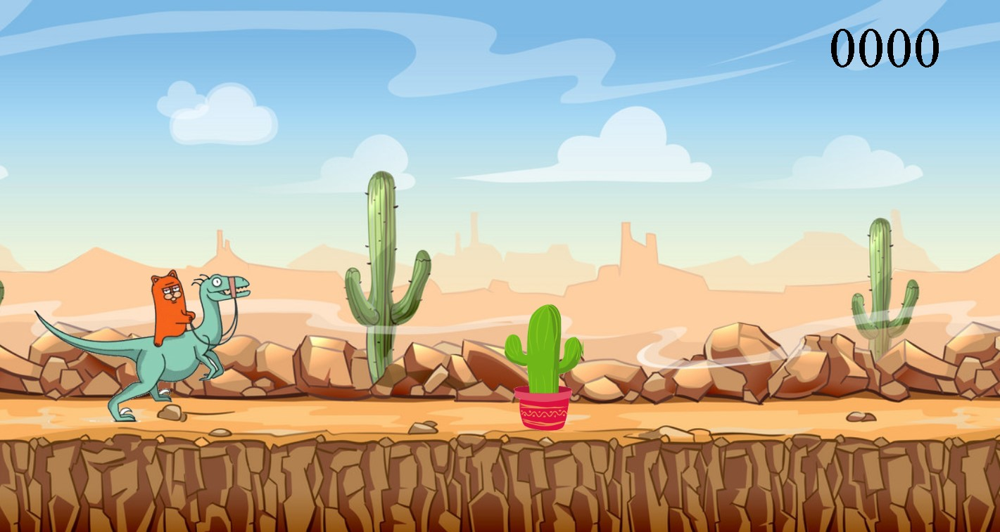
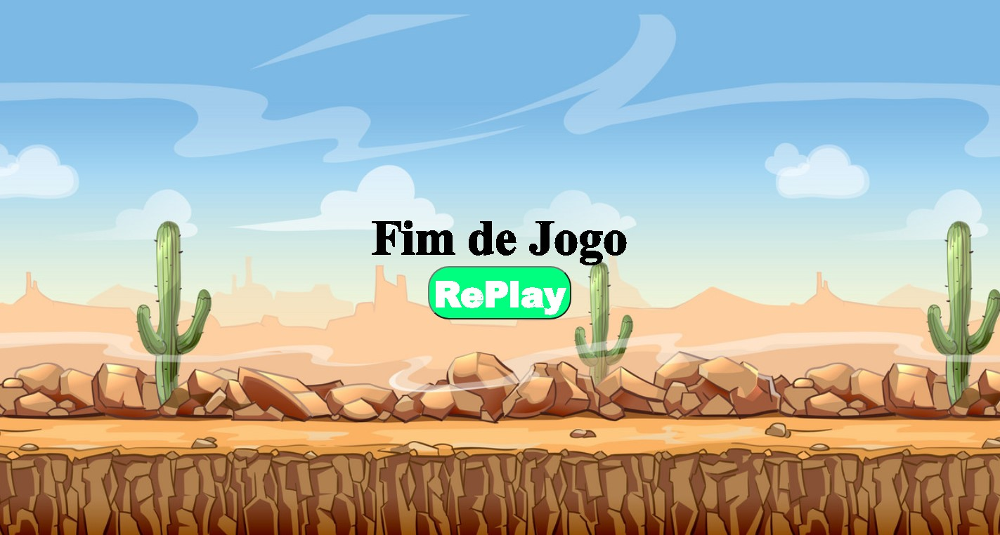

# DinoCAT Game :

Olá! Bem Vindo ao meu Jogo do DinoCAT :wave:

<h1 align="center">
    
    
</h1>

<p align="center">
 <a href="#-sobre-o-projeto">Sobre</a> •
 <a href="#-clonando-a-aplicação">Clonando a aplicação</a> •
 <a href="#-tecnologias">Tecnologias</a> • 
 <a href="#-como-executar-o-projeto">Como executar</a> • 
 <a href="#-tecnologias">Tecnologias</a> • 
 <a href="#-creditos-imagem">Creditos</a> • 
 <a href="#-licença">Licença</a> • 
</p>


## 💻 Sobre o projeto

♻️ DinoCAT Game - é uma aplicação desenvolvida com as informações aprendida nas Aulas da DigitalInovationOne.

https://web.digitalinnovation.one/lab/recriando-o-famoso-jogo-do-dinossauro-sem-internet/

---


## 🧭 Clonando a aplicação 

```bash

# Clone este repositório
$ git remote add origin https://github.com/GilsonMartias/dinocat-game.git

# Acesse a pasta do projeto no seu terminal/cmd
$ cd dinocat-game


```

---
## 🛠 Tecnologias

As seguintes ferramentas foram usadas na construção do projeto:

* JavaScript 

* HTML5

* CSS

* CorelDraw

  ​

## :copyright: Creditos - imagem

* https://giphy.com/

* https://tenor.com/

* https://google.com/


## 📝 Licença

Este projeto esta sobe a licença [MIT](./LICENSE).

Feito com ❤️ por Gilson Martias 👋🏽 [Entre em contato!](https://www.linkedin.com/in/gilsonfernandomartias/)

---


